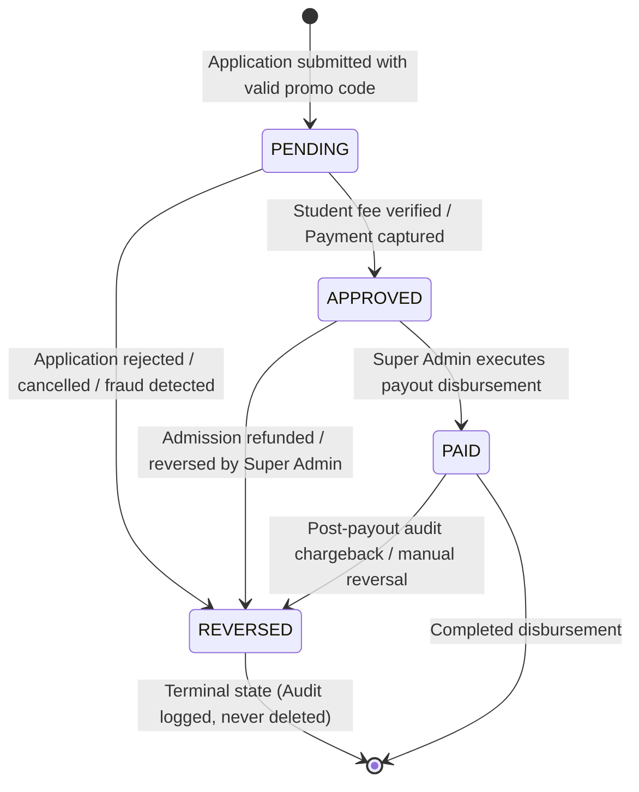

# Agent / Referral Promo Code System Architecture & Technical Specifications

## 1. System Overview

The Agent / Referral Promo Code System introduces affiliate partner tracking, student promotional incentives, and ledger-based commission accounting to the Deekshaam Business School admissions platform. 

It guarantees **zero regression** for standard applicants: when no promo code is supplied, or when the system feature flag (`AGENT_REFERRAL_ENABLED`) is toggled off, the application operates strictly across its pre-existing baseline paths.

All monetary values are modeled in **integer minor units (paise)** to eliminate IEEE 754 floating-point inaccuracies. Client submissions for discounts and fees are never trusted; the backend re-validates promo codes and recomputes all financial metrics server-side.

---

## 2. Entity Relationship Model

The system expands the dual-persistence database schema (PostgreSQL Prisma + In-Memory Fallback) with four new core entities and non-breaking nullable extensions to the application ledger.

```mermaid
erDiagram
    User ||--o| Agent : "provisions login"
    Agent ||--o{ Application : "refers applicants"
    Agent ||--o{ AgentCommission : "earns commissions"
    Agent ||--o{ AgentPayout : "receives disbursements"
    AgentPayout ||--o{ AgentCommission : "settles"
    Application ||--o| AgentCommission : "generates ledger entry"
    User ||--o{ AgentAuditLog : "generates audit events"

    User {
        string id PK
        string email UK
        string name
        string role
        boolean isActive
    }

    Agent {
        string id PK
        string userId FK, UK
        string name
        string email UK
        string phone
        string status
        string promoCode UK
        decimal commissionPercent
        decimal studentDiscountPercent
        boolean isConfigured
        string payoutDetails
        string notes
        string createdBy
        datetime createdAt
        datetime updatedAt
        datetime deletedAt
    }

    Application {
        string id PK
        string fullName
        string email
        string phone
        string programSlug
        string status
        int stage
        string agentId FK, nullable
        string promoCodeUsed nullable
        decimal discountPercentApplied nullable
        int discountAmountPaise nullable
        decimal commissionPercentApplied nullable
        int feeAmountPaise
    }

    AgentCommission {
        string id PK
        string agentId FK
        string admissionId FK, UK
        int baseAmountPaise
        decimal commissionPercent
        int commissionAmountPaise
        string status
        datetime approvedAt
        datetime paidAt
        string payoutId FK, nullable
        string reversalReason
        datetime createdAt
        datetime updatedAt
    }

    AgentPayout {
        string id PK
        string agentId FK
        int totalAmountPaise
        string method
        string reference
        string paidBy
        datetime paidAt
        string note
        datetime createdAt
    }

    AgentAuditLog {
        string id PK
        string actorUserId
        string action
        string entityType
        string entityId
        string oldValue
        string newValue
        string ip
        datetime createdAt
    }

    ReferralSettings {
        string id PK
        decimal defaultCommissionPercent
        decimal defaultDiscountPercent
        string commissionBase
        decimal maxAllowedDiscountPercent
        decimal maxAllowedCommissionPercent
        boolean isEnabled
        datetime updatedAt
    }
```

---

## 3. Commission Lifecycle State Machine

Commissions are managed strictly as immutable double-entry ledger items that transition across deterministic states:



### State Definitions & Transitions
1. **PENDING**: Created synchronously inside the application submission transaction when a candidate applies with an active, valid partner promo code. Student fee has not yet been captured.
2. **APPROVED**: Automatically transitioned when the student's Razorpay payment verification succeeds or a manual fee receipt is confirmed by Admissions staff. In this state, funds are categorized as "Payable" on both the Agent Portal and Admin Ledger.
3. **PAID**: Transitioned in batch when a Super Administrator records a bank wire (NEFT/IMPS) or UPI disbursement in the Commissions ledger. All settled commissions are linked to the unique `AgentPayout` entity.
4. **REVERSED**: Transitioned automatically when an admission status changes to `REJECTED`, or manually during payment refunds. Once reversed, commissions are excluded from payable balances with immutable audit logging.

---

## 4. Promo Code Format & Anti-Collision Engine

- **Format**: `^[A-Z]{2,4}[0-9]{1,3}[A-Z]?$` (e.g. `PD10`, `PD10A`, `KV15`).
- **Algorithm**:
  1. Extract uppercase initials from the agent's full name (e.g., "Prashant Dhavan" $\to$ `PD`).
  2. Append the configured student discount percentage (e.g. `10` $\to$ `PD10`). If discount is 0%, append two pseudo-random digits avoiding ambiguous characters.
  3. Safe Charset: Excludes visually ambiguous characters `0/O`, `1/I/L`.
  4. Collision Resolution: If `PD10` exists, systematically append suffixes `PD10A`, `PD10B`, ... until a unique key is achieved.
  5. Canonicalization: All inputs are trimmed, stripped of special characters, and converted to uppercase upon lookup.

---

## 5. Security & Anti-Fraud Architecture

1. **Zero Client Trust**: Discount amount, commission amount, and fee calculation are strictly computed on the server. The client's payload discount is discarded.
2. **Self-Referral Prevention**:
   - The applicant's email address cannot match the agent's email address.
   - The applicant's contact number cannot match or suffix-match the agent's phone number.
   - The authenticated user's ID (if signed in) cannot match the agent's associated user ID.
3. **PII Masking**: Agents can only access candidate data referred through their unique code. Critical PII is masked server-side prior to response rendering (`98****10`, `r****@gmail.com`, `Rahul S.`).
4. **Rate Limiting**: Public promo code validation endpoints (`/api/referral/validate`) are protected by an IP-based rate limiter (10 attempts per minute) to prevent dictionary enumeration.
5. **Neutral Error Responses**: Invalid, expired, and suspended promo codes return a generic 400 error message (`"This code is not valid."`) to avoid leaking agent account statuses.
